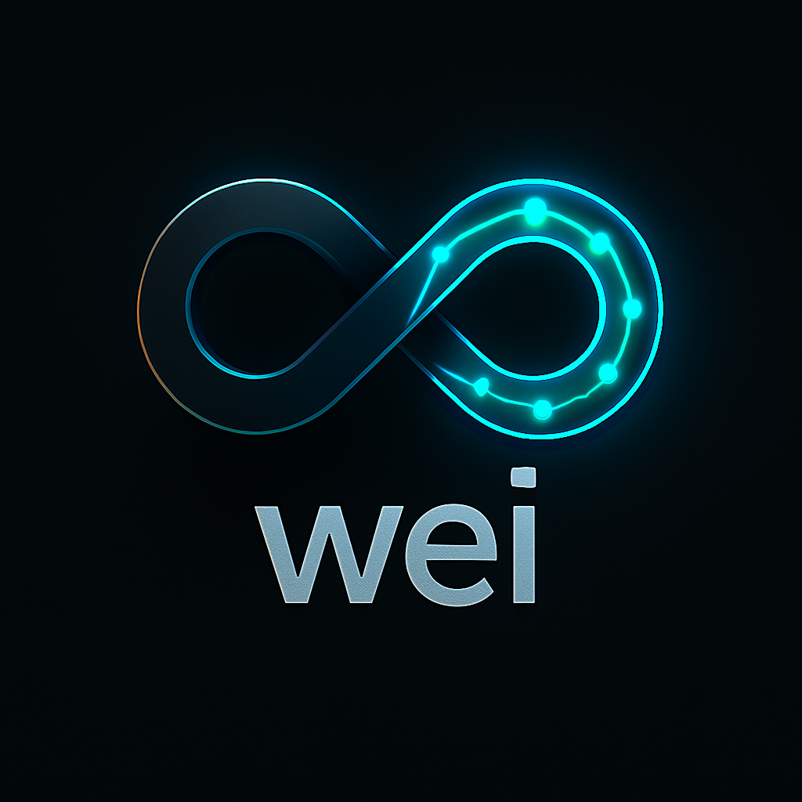

# Wei

**Advancing Agent-Driven Protocol Development**

Wei develops autonomous agents for blockchain protocol development and governance, focusing on creating specialized agents that participate in core development, protocol optimization, and governance processes within the Ethereum ecosystem.

## Links

- 📖 **[Vision & Mission](https://wei-lite-paper.vercel.app/)** - Lite Paper
- 📋 **[Internal Documentation](https://www.notion.so/nethermind/Wei-Governance-Agents-231360fc38d0808ead4be02d94345198)** - Nethermind Notion
- 💬 **[Telegram](https://t.me/AgentWei)** - @AgentWei
- 🔗 **[GitHub](https://github.com/nethermindeth/wei)** - Main Repository