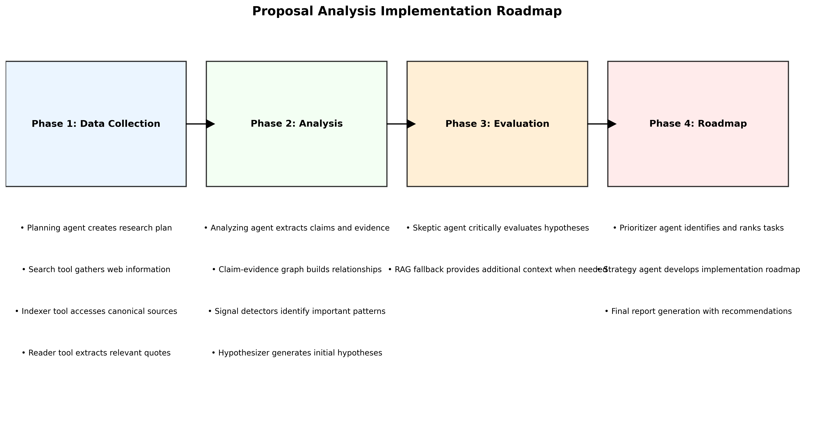

# Wei Notebook: Proposal Analysis System Tutorial

## Overview

Wei Notebook is an advanced proposal analysis system designed to evaluate governance proposals for blockchain protocols. It uses a multi-agent workflow with LLM-powered components to analyze proposals, extract key insights, and provide structured evaluations.

## System Architecture

The system is built around a workflow of specialized agents that work together to analyze proposals:

1. **Planning Agent**: Creates a research plan based on the proposal
2. **Search Tool**: Searches the web for relevant information
3. **Indexer Tool**: Accesses canonical sources like EIPs, BIPs, and forum posts
4. **Reader Tool**: Extracts content from documents and clips relevant quotes
5. **Analyzing Agent**: Extracts claims and evidence from the quotes
6. **Claim-Evidence Graph**: Builds a graph of claims and supporting evidence
7. **Signal Detectors**: Identifies important signals in the data
8. **Hypothesizer**: Generates hypotheses based on the signals
9. **Skeptic Agent**: Critically evaluates the hypotheses
10. **RAG Fallback**: Provides additional context when needed
11. **Prioritizer Agent**: Prioritizes tasks and identifies blockers
12. **Strategy Agent**: Develops a strategic roadmap for implementation

### Workflow Visualization


*The complete workflow of the proposal analysis system showing how components interact.*

### Implementation Roadmap



*The implementation roadmap showing the four phases of the proposal analysis process.*

## Key Files and Components

### Core Components

- **proposal_analyzer.py**: The main workflow orchestrator that connects all agents
- **agent_nodes.py**: Contains all the agent implementations
- **agent_state.py**: Defines the state structure passed between agents
- **agent_tools.py**: Implements tools for search, indexing, and reading

### Support Components

- **disable_langchain_tracing.py**: Disables LangChain tracing for cleaner output
- **langfuse_setup.py**: Provides tracing functionality for LLM calls

### Entry Point

- **proposal_analysis_example.py**: Example usage with a sample proposal

## Setting Up the Environment

### Prerequisites

- Python 3.9+
- Required API keys:
  - OpenRouter API key (for LLM access)
  - Exa API key (for search and retrieval)

### Environment Variables

Create a `.env` file with the following variables:

```
WEI_AGENT_OPEN_ROUTER_API_KEY=your_openrouter_api_key
WEI_AGENT_EXA_API_KEY=your_exa_api_key
```

### Installation

1. Clone the repository
2. Install dependencies:
   ```
   pip install -r requirements.txt
   ```

## Using the System

### Basic Usage

```python
from proposal_analyzer import analyze_proposal
from agent_state import ProposalMetadata

# Define your proposal text
proposal_text = """
# Proposal Title

## Abstract
Proposal details...

## Motivation
...
"""

# Define metadata
metadata = {
    "id": "PROP-123",
    "title": "Your Proposal Title",
    "author": "Author Name",
    "date_submitted": "2025-09-22",
    "protocol": "Ethereum",  # or Bitcoin, Aave, etc.
    "category": "Core",      # or Governance, DeFi, etc.
    "url": "https://example.com/proposal"
}

# Run the analysis
result = analyze_proposal(proposal_text, metadata)

# Access the results
tasks = result["tasks"]
blockers = result["blockers"]
evidence_summary = result["evidence_summary"]
next_steps = result["next_steps"]
evaluation_report = result["evaluation_report"]
```

### Understanding the Results

The analysis result contains several key components:

1. **Tasks**: Prioritized tasks identified from the proposal
2. **Blockers**: Potential issues that might block implementation
3. **Evidence Summary**: A summary of the evidence found
4. **Next Steps**: Recommended next actions
5. **Evaluation Report**: A comprehensive evaluation including:
   - Goals and motivation assessment
   - Measurable outcomes evaluation
   - Budget analysis
   - Technical specifications review
   - Language quality assessment
   - Arguments for and against the proposal

## Workflow Details

### 1. Planning Phase

The Planning Agent creates a detailed research plan based on the proposal text and metadata. It identifies key areas to investigate and questions to answer.

```python
# Example planning agent output
"""
Research Plan:
1. Investigate technical feasibility
2. Assess economic implications
3. Evaluate governance impact
4. Research similar proposals
"""
```

### 2. Research Phase

The Search Tool, Indexer Tool, and Reader Tool work together to gather relevant information:

- Search Tool queries the web for relevant content
- Indexer Tool accesses canonical sources like EIPs and forum posts
- Reader Tool extracts content and clips relevant quotes

### 3. Analysis Phase

The Analyzing Agent extracts claims and evidence from the gathered information, which are organized into a claim-evidence graph.

```python
# Example claim-evidence structure
{
    "claim": "The proposal improves scalability",
    "evidence": ["Benchmark shows 10x throughput", "Similar approach succeeded in other protocols"],
    "sources": ["research_paper", "protocol_blog"],
    "confidence": 0.85
}
```

### 4. Evaluation Phase

Signal Detectors identify important signals, the Hypothesizer generates hypotheses, and the Skeptic Agent critically evaluates them. When needed, the RAG Fallback provides additional context.

### 5. Prioritization Phase

The Prioritizer Agent identifies and prioritizes tasks, and the Strategy Agent develops a strategic roadmap for implementation.

### 6. Roadmap Generation with Perplexity

The system uses Perplexity's Sonar-Pro model (via OpenRouter API) to generate detailed implementation roadmaps. This provides:

- Milestone planning with dependencies and timelines
- Resource requirement analysis
- Risk assessment and mitigation strategies
- Success metrics and evaluation criteria

## Advanced Usage

### Customizing the Analysis

You can customize the analysis by modifying the agent prompts in `agent_nodes.py` or by adjusting the workflow in `proposal_analyzer.py`.

### Tracing LLM Calls

The system uses a simplified tracing mechanism through `langfuse_setup.py`. Each LLM call is logged with:

- Model name
- Latency
- Metadata
- Trace ID

### Adding Visualizations to the Notebook

The repository includes two visualization files:
- `workflow_visualization.png` - Shows the complete workflow of the system
- `roadmap_visualization.png` - Shows the implementation roadmap

To include these visualizations in your Jupyter notebook:

```python
# Add these cells to your notebook
from IPython.display import Image, display, Markdown

# Display workflow visualization
display(Markdown("## Workflow Visualization"))
display(Image(filename="workflow_visualization.png"))

# Display roadmap visualization
display(Markdown("## Implementation Roadmap"))
display(Image(filename="roadmap_visualization.png"))
```

You can also generate these visualizations programmatically using the `workflow_visualization.py` script:

```python
from workflow_visualization import visualize_workflow, create_roadmap_visualization

# Generate and display the workflow visualization
workflow_plt = visualize_workflow()
workflow_plt.show()

# Generate and display the roadmap visualization
roadmap_plt = create_roadmap_visualization()
roadmap_plt.show()
```

### Using the Perplexity-Powered Roadmap Generator

The repository includes a roadmap generator that uses Perplexity's Sonar-Pro model via OpenRouter API:

```python
# Add these cells to your notebook
from roadmap_generator import generate_roadmap, format_roadmap_for_display
from IPython.display import HTML

# Generate the roadmap using Perplexity/Sonar-Pro
roadmap_data = generate_roadmap(proposal_text, metadata)

# Format and display the roadmap
roadmap_html = format_roadmap_for_display(roadmap_data)
display(HTML(roadmap_html))
```

This will generate a detailed implementation roadmap with milestones, resources, risks, and success metrics.

## Troubleshooting

### Common Issues

1. **Missing API Keys**: Ensure your `.env` file contains the required API keys
2. **Import Errors**: Make sure all dependencies are installed
3. **LLM Errors**: Check your OpenRouter API key and quota

### Debugging

Use the trace IDs from LLM calls to track the flow of information through the system.

## Extending the System

### Adding New Agents

1. Define a new agent function in `agent_nodes.py`
2. Update the workflow in `proposal_analyzer.py` to include your agent
3. Update the state definition in `agent_state.py` if needed

### Adding New Tools

1. Implement your tool in `agent_tools.py`
2. Initialize it in `agent_nodes.py`
3. Use it in the appropriate agent function

## Conclusion

The Wei Notebook proposal analysis system provides a powerful framework for analyzing governance proposals. By combining multiple specialized agents with external knowledge sources, it delivers comprehensive and structured evaluations to help stakeholders make informed decisions.

For more information, refer to the code documentation in each file.
